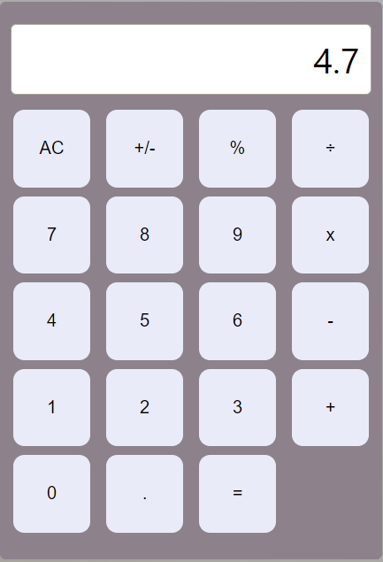

# React Calculator App

This is a simple calculator application built using React. It allows you to perform basic arithmetic operations.

## Live Preview

👉 [Click here to try the live version](https://mohitahlawat-calculator-app.netlify.app/)

## How to Use Locally

Follow these steps to run the calculator application on your local machine:

1. **Clone the Repository**
   ```
   git clone https://github.com/mohitahlawat2001/calculator-app.git
   ```
2. **Navigate to the Project Directory**
   ```
   cd calculator-app
   ```
3. **Install Dependencies**
   ```
   npm install
   ```
4. **Start the Application**
   ```
   npm start
   ```
5. **Open in Browser**
   - Open your web browser and go to [http://localhost:3000](http://localhost:3000)
   - You should now see the calculator application running locally on your machine.

## Features

- Addition, Subtraction, Multiplication, Division
- Clear All (AC)
- Supports decimal numbers

## Screenshots
<div style="display: flex; flex-direction: row;">
   
   
</div>
<div style="display: flex; flex-direction: row;">
   
   
</div>

## Contributing

If you'd like to contribute, please fork the repository and create a pull request. You can also open an issue for any bug reports or feature requests.

## Hacktoberfest

### What is Hacktoberfest ?

[Hacktoberfest](https://hacktoberfest.com/about/) is a month-long celebration of open source software. It encourages developers to contribute to open source projects by submitting pull requests on GitHub. It's a fantastic opportunity to support the open source community, learn, and earn cool swag.

### How to Participate ?

1. **Register**: Sign up on the [Hacktoberfest website](https://hacktoberfest.com/).

2. **Contribute**: Make at least four pull requests to any public GitHub repository. These can be fixes, improvements, or new features.

3. **Follow the Rules**: Ensure that your pull requests adhere to the Hacktoberfest guidelines.

4. **Spread the Word**: Encourage others to participate in Hacktoberfest.

For more details, check out the official [Hacktoberfest website](https://hacktoberfest.com/about/).

---

Feel free to reach out with any questions or feedback. Happy calculating! 🧮
