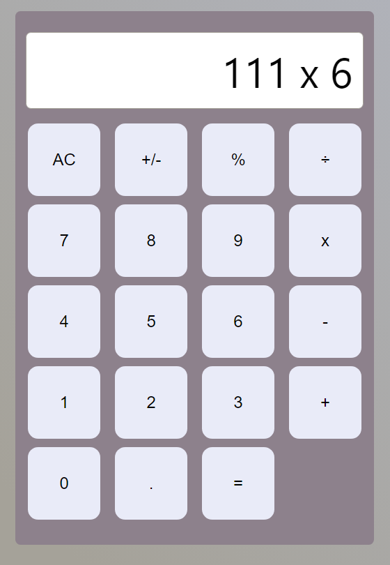
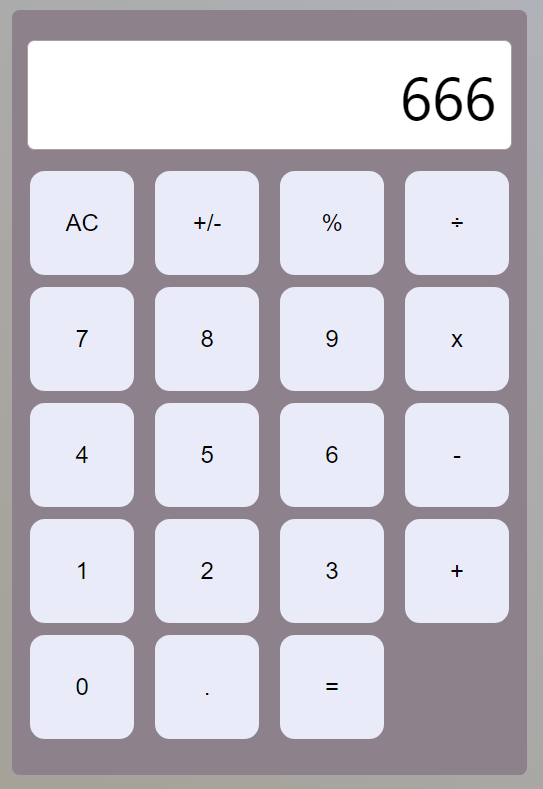

# React Calculator App

This is a simple calculator application built using React. It allows you to perform basic arithmetic operations.

## Live Preview
👉 [Click here to try the live version](https://mohitahlawat-calculator-app.netlify.app/)

## How to Use Locally

Follow these steps to run the calculator application on your local machine:

1. **Clone the Repository**
   ```
   git clone https://github.com/mohitahlawat2001/calculator-app.git
   ```
   
2. **Navigate to the Project Directory**
   ```
   cd calculator-app
   ```
   
3. **Install Dependencies**
   ```
   npm install
   ```
   
4. **Start the Application**
   ```
   npm start
   ```
   
5. **Open in Browser**
   - Open your web browser and go to [http://localhost:3000](http://localhost:3000)
   - You should now see the calculator application running locally on your machine.

## Features

- Addition, Subtraction, Multiplication, Division
- Clear All (AC)
- Supports decimal numbers

## Screenshots





## Contributing

If you'd like to contribute, please fork the repository and create a pull request. You can also open an issue for any bug reports or feature requests.

---

Feel free to reach out with any questions or feedback. Happy calculating! 🧮